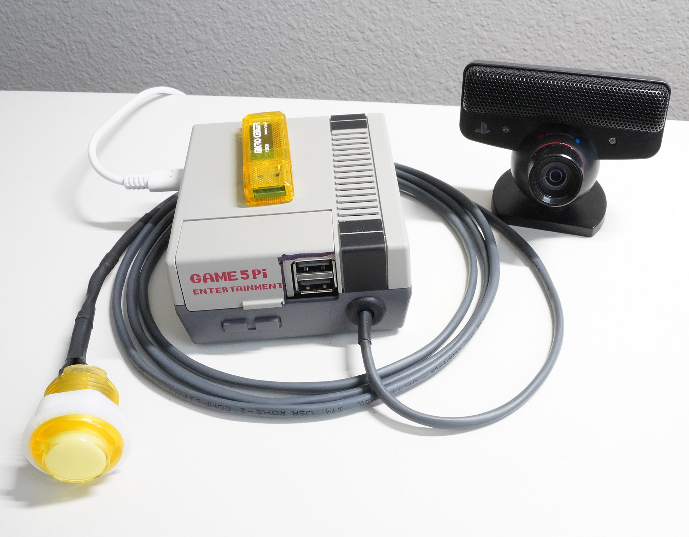

# TrooperAI: Local Conversational AI for Raspberry Pi5

The TrooperAI project was a test to see if I could build a low-latency, local (non-networked) voice assistant in Python for the Raspberry Pi. The system combines real-time speech recognition, LLM-based dialog, and high-quality TTS into a reactive system running on Raspberry Pi5.

The final device is housed in a Game 5 Pi retro arcade case. The AdaFruit arcade style LED button was integrated to provide feedback and control. USB ports are used for the camera/mic array (Playstation Eye) and speaker audio out. A USB flash drive is used for headless configuration. This ultimate plan is to integrate TrooperAI into a life-size Stormtrooper to bring him to life.



## Conclusion

The project was a success. Both the streaming and batch architectures ( `server.py`and `server-batch.py` files) were capable of providing low enough latency to make possible a reasonable conversation with TrooperAI. `Gemma2:2b` and `Qwen2.5:0.5b` models provided acceptable performance. The Gemma2 model was able to provide a more direct, authoritarian persona, while Qwen2.5 was faster, but generally provided a more friendly interaction. The programmable `System Message` is key in tuning your desired personality. I decided on Vosk for STT, although i did extensive testing with faster-whisper. Piper gave excellent performance for TTS.

## Features

- Fully integrated into headless Raspberry Pi5-8Gb
- No reliance on remote API calls or cloud providers
- WebSocket client/server architecture with full-duplex mic/speaker support
- Sentence streaming Speech-to-Text (STT) using lightweight Vosk model.  Support for any Vosk voice. Realistic Trooper voice achieved using stock Piper voice `en_US-danny-low.onnx`. Additional support for add-on voice effects.
- Sentence-by-sentence streaming Text-to-Speech (TTS) using Piper
- LLM inference is achieved locally using Ollama. Tested with two lightweight models: `gemma2:0.5b` and `qwen2.5:0.6b`
- Configurable mic-mute mode for setup with a speaker and separate mic
- JSON-based configuration file: `.trooper_config.json`
- Configurable device names (mic and speaker)
- Arcade style lighted button for visual feedback and control. The large LED provides feedback (listening / speaking / thinking) and a push button to start or stop sessions as an alternative to gesture detection mode.
- Detection and elimination of false low-energy utterances
- System can be triggered via gesture detection (camera + MediaPipe Hands model)

## Performance

Packing a low-latency voice system onto a raspberry pi device was a challenge. The Pi5 made this project possible. I opted not to include the AI kit or SSD, so the system runs on a stock Pi5 8Gb RAM and a 32Gb MicroSD card running stock Pi OS.

During Vosk STT, Inference via Ollama, and Piper TTS, the CPU on the Pi5 is completely maxed out at 100%.

The active cooler fan was installed as well as an additional case fan integrated in the Pi52 retro arcade case.

Over a large number of dialog samples, the following average timings were recorded:

- Vosk STT ~10ms
- LLM ~3–15 sec depending on prompt
- Piper TTS ~2–5 sec per response
- All speech was streamed sentence-by-sentence for responsiveness

Note that neither the Vosk STT (input) nor Piper TTS (output) were designed for true token by token streaming. I had to modify the system to detect sentence breaks via punctuation and silence boundaries to trigger the stream. The allows for long responses from the LLM to be read back without waiting for the entire response, making the system seem much more responsive. The system is able to respond with long elaborate stories, especially using the `gemma2:0.5b` model without issue.

I experimented with Faster-Whisper projects as an alternative to Vosk. In the end, I stayed with Vosk. It was lighter and worked well. I observed the even Whisper STT was not designed for true streaming and while it was responsive on the Pi5, it still would require modifications to keep sentences together. The small Vosk model, while lower performing, was satisfactory for my Trooper application. If you are building a therapist, for example, or application where greater accuracy is required, you may need to pursue Faster-Whisper.

## Python File Overview

| File              | Description                                                  |
| ----------------- | ------------------------------------------------------------ |
| `main.py`         | **Main system entrypoint**. Manages session lifecycle (start/stop), LED state, and gesture-based or button-based activation. Handles Piper playback for greetings and timeouts. Pre-warms the LLM model. |
| `client.py`       | **Audio interface and WebSocket client**. Captures audio from the mic, sends it to the server, and plays back streamed TTS audio. Handles volume control, fade-in/out, and mic muting to prevent feedback. |
| `server.py`       | **Streaming WebSocket server**. Receives audio, performs real-time speech-to-text (Vosk), queries the LLM via Ollama, and streams TTS responses (Piper). Sends playback audio back in chunks for smooth UX. |
| `server-batch.py` | **Non-streaming batch-mode server (alternative)**. Similar to `server.py`, but processes entire LLM responses before sending TTS back as a whole. Useful for simpler or legacy setups. |
| `utils.py`        | **Shared utilities**. Includes configuration loading (USB override), audio device detection, LED control via FIFO pipe, and fade-in/out DSP for playback audio. |

## Core Architecture

The primary goal of the project to was to create a local voice solution, small enough to install in a life-size storm trooper, with acceptable latency to allow for a natural conversation with the Trooper.

#### Speech Input

The system captures audio through a Playstation PS-Eye mic array connected to the Raspberry Pi5 via USB-A port. The PS-Eye has a 4 mic array that is sensitive enough to allow users at a distance to be able to speak to the Trooper.

Audio-in highlights:

- Uses `PyAudio` to capture live mic input.
- Optional voice activity detection (VAD) gates LED feedback.
- Audio is streamed to the server in 16kHz mono PCM format.

#### Vosk Speech Recognition (STT)

- Vosk is used in batch mode.
- Each utterance is sent to the LLM only after a silence break.

#### Ollama LLM

For inference, the system uses a local Ollama install to provide API for the chosen LLM model. Multiple models supported using Ollama. Two models have been tested expensively with the project, `gemma2:2b` and `qwen2.5:0.5b`.  You can pull models onto the Pi5 as long as you have free RAM to store them. 

```
$ ollama list
NAME                   ID              SIZE      MODIFIED     
qwen2.5:0.5b           a8b0c5157701    397 MB    10 days ago     
tinyllama:latest       2644915ede35    637 MB    5 weeks ago     
gemma2:2b              8ccf136fdd52    1.6 GB    6 weeks ago       
smallthinker:latest    945eb1864589    3.6 GB    4 months ago      
```

To keep the system responsive, you need to choose a lightweight model, otherwise the token rate out of Ollama will be insufficient to provide a comfortable conversation. The system uses `Ollama` to stream JSON token-by-token responses. Each sentence-ending token triggers real-time TTS.

Choose your model in the JSON configuration file:

```
  "model_name": "gemma2:2b",
```

The system also implements configurable System Prompt to give the Trooper his personality. The default System Prompt for Trooper is also stored in the JSON configuration file:

```
"system_prompt":   "You are a loyal Imperial Stormtrooper. 
					You need to keep order. 
					Your weapon is a gun. 
					Dont ask to help or assist.",
```

#### Piper Text-to-Speech (TTS)

The system uses the Piper Text-to-Speech engine for natural voice synthesis.

- Piper generates 16kHz mono audio.
- SoX upsamples to 48kHz stereo.
- Optional Retro Voice FX filtering (SoX high-pass, low-pass, compand, and noise mix) can be applied using SoX high-pass, low-pass, and noise effects.
- Audio is streamed back to the client in ~2048 byte chunks.

#### Audio Output

Audio is implemented using a low-cost USB speaker.

- Audio is played in a background thread using `PyAudio`.
- ~50ms of silence is prepended to each sentence to avoid clipping.
- A playback queue ensures smooth streaming.
- Fade-in and Fade-out effects are applied to voice outputs for smoother audio.

#### LED/Switch/Camera Integration

The system integrates an LED / Switch combination. The LED is used to communicate status of the system. The AdaFruit 30mm illuminated arcade style button can be used to start/stop a session with the Trooper.

- LED modes reflect states: `listen`, `blink`, `speak`, `solid`.
- Controlled via FIFO pipe (`/tmp/trooper_led`) and interpreted by `main.py`.

The switch is wired into GPIO pins of the Raspberry Pi5.

The Playstation Eye USB camera / microphone is used for camera and audio input. The device provides a sensitive 4-array microphone. The camera is used for gesture detection to initiate sessions automatically.

## Project Structure

```
Trooper/
├── client.py             # Audio I/O, mic, speaker, LED
├── server.py             # Streaming server: LLM, STT, TTS processing
├── server-batch.py       # Batch mode server, lower latency, but doesn't handle long streams
├── main.py               # Launches client on gesture/button
├── utils.py              # Shared helpers (e.g. led_request)
├── voices/               # Piper voice models
├── .trooper_config.json  # JSON config file
├── requirements.txt      # Dependencies file
├── client.log            # Log output for client debug
```

## Project Requirements

#### Python Dependencies

Install all required Python packages via:

```
pip install -r requirements.txt
```

**`requirements.txt`**

```
aiofiles==23.2.1
aiohttp==3.9.3
asyncio
numpy==1.26.4
pyaudio==0.2.13
python-dotenv==1.0.1
soxr==0.3.7
soundfile==0.12.1
websockets==12.0
vosk==0.3.45
gpiozero==2.0
lgpio==0.0.4
opencv-python==4.9.0.80
mediapipe==0.10.9
```

> `pyaudio` may require `portaudio19-dev` to build correctly on some systems.

#### System Dependencies

These are **not** installed via pip and must be installed via your OS package manager or manually.

##### APT Install (Debian / Ubuntu)

```
sudo apt update && sudo apt install -y \
    sox \
    pulseaudio \
    ffmpeg \
    python3-pyaudio \
    libasound-dev \
    portaudio19-dev
```

##### Piper (Text-to-Speech Engine)

Used for fast local speech synthesis.

```
# Build from source (requires Rust)
cargo install piper

# OR download a prebuilt binary from:
# https://github.com/rhasspy/piper/releases
```

> Place the binary at `~/.local/bin/piper` or update the path in `server.py`.

##### Ollama (LLM Backend)

Ollama runs your local language models like `gemma` or `llama3`.

```
curl -fsSL https://ollama.com/install.sh | sh
```

Start and load your preferred model:

```
ollama serve &
ollama pull gemma:2b
```

##### Audio System

Ensure `PulseAudio` is running:

```
pulseaudio --start
```

Make sure your user is in the audio group:

```
sudo usermod -aG audio $USER
```

Then log out or reboot.

To test the system, start the `server.py` and `main.py`. If you don't wont the button control, you can start `client.py` directly instead of starting `main.py`:

```
# Start the server
cd Trooper && python3 server.py

# Start the main, which controls the initial and closing greetings, the button, and launches the client
cd Trooper && python3 main.py

# Start the client directly
cd Trooper && python3 client.py
```

For automatic operation, the client and server can be started via `Systemd` (below)

## WebSocket Architecture

Trooper uses a bidirectional WebSocket connection between the **client** (audio I/O and playback on device) and the **server** (speech recognition, LLM inference, and TTS).

#### Message Flow Overview

```
[ Mic Audio ] ──► client.py ── send ─► server.py ──► 
STT ─► LLM ─► TTS ──► 
client.py ──► [ Audio Output ]
```

#### Message Loop

##### 1. **Client → Server**

- The microphone stream is continuously captured.
- It is resampled (if needed) and sent as **binary audio chunks** via WebSocket.
- These chunks are 16kHz mono PCM in `int16` format.

##### 2. **Server**

- Uses `Vosk` for real-time speech recognition.
- Once a full utterance is detected:
  - The transcript is sent to the LLM (via Ollama).
  - The response is synthesized using `Piper`.
  - Audio is optionally processed with SoX for retro voice effects.

##### 3. **Server → Client**

- The TTS audio is streamed back in small binary chunks.
- When playback is complete, the server sends the string message `"__END__"`.

##### 4. **Client Playback**

- On receiving audio, the client:
  - Optionally mutes the mic to prevent feedback.
  - Plays the audio stream in real time.
  - Sends `"__done__"` to the server to indicate playback is finished.

#### Message Types

| Direction       | Type         | Description                                       |
| --------------- | ------------ | ------------------------------------------------- |
| Client → Server | `bytes`      | 16-bit PCM audio input                            |
| Server → Client | `bytes`      | 16-bit PCM TTS output                             |
| Server → Client | `"__END__"`  | Signals end of TTS segment                        |
| Client → Server | `"__done__"` | Signals playback complete (used for LED feedback) |

## Configuration

The system is configured via a JSON file named `.trooper_config.json`, located in the home directory. This file controls audio devices, behavior, personality, and more.

#### USB-Based Configuration Override

To support headless operation, configuration updates can be applied via a USB flash drive:

- Format the drive with the name: `Trooper`
- Place a file named: `trooper_config.json` in the root of the USB
- On boot or restart, if the USB file is detected, it will:
  - Be **loaded immediately**
  - Be **copied** to `~/.trooper_config.json`, making it the new default

This allows users to easily update the Trooper's persona (e.g. voice, model, prompt) without SSH access.

#### Sample Configuration

```
{
  "mic_name": "USB Camera-B4.09.24.1: Audio",
  "audio_output_device": "USB PnP Sound Device: Audio",
  "mute_mic_during_playback": true,
  "fade_duration_ms": 10,
  "retro_voice_fx": false,
  "history_length": 6,
  "model_name": "llama3:8b",
  "voice": "danny-low.onnx",
  "volume": 90,
  "system_prompt": "You are a loyal Imperial Stormtrooper. 
  					Keep responses terse and authoritative."
}
```

#### Parameter Descriptions

| Key                        | Description                                                  |
| -------------------------- | ------------------------------------------------------------ |
| `mic_name`                 | Match string for input device name                           |
| `audio_output_device`      | Match string for output device name                          |
| `mute_mic_during_playback` | Prevents mic bleed during playback (recommended `true`)      |
| `fade_duration_ms`         | Fade duration at start/end of playback. Use `0` to disable.  |
| `retro_voice_fx`           | If `true`, applies SoX-based filtering to make audio sound more vintage |
| `history_length`           | Number of past exchanges to include in LLM context           |
| `model_name`               | Name of the local model to use via Ollama (e.g. `gemma:2b`, `llama3:8b`) |
| `voice`                    | Filename of the Piper voice model in the `voices/` directory |
| `volume`                   | System volume level (0–100) applied at startup               |
| `system_prompt`            | The LLM's default persona instruction (e.g. for tone, role, behavior) |

## Vision-Based Wake (Gesture Detection)

TrooperAI supports **gesture-based activation** as an alternative to the physical button.

Using a webcam and the MediaPipe library, the system continuously monitors for a raised open hand gesture using real-time hand landmark detection. When five fingers are detected extended for a brief streak, Trooper toggles its session (start/stop).

#### Activation Logic

- Uses **MediaPipe Hands** for landmark tracking
- Requires 5 fingers to be up
- Requires a **streak** of consistent detection (e.g. 5 frames in a row)
- Cooldown enforced between gesture activations (default: 10 seconds)

#### Requirements

This feature requires:

- `opencv-python`
- `mediapipe`

These are included in the `requirements.txt`.

#### Enable Gesture Detection

Gesture detection is optional and controlled via config:

```
{
  "vision_wake": true
}
```

Set this flag in your `.trooper_config.json` or `trooper_config.json` on the USB.

## GPIO Connections

The Trooper system uses the Raspberry Pi 5’s GPIO header to connect:

- A **30mm Adafruit arcade-style LED pushbutton**
- A **case cooling fan**
- The **official Pi5 active cooler** (connected separately via fan header)

#### GPIO Pinout Table

| Component              | GPIO Pin | Physical Pin | Function                     |
| ---------------------- | -------- | ------------ | ---------------------------- |
| **Arcade Button**      | GPIO 17  | Pin 11       | Input (detect button press)  |
| **Button LED**         | GPIO 18  | Pin 12       | Output (blink status LED)    |
| **Button Power (+5V)** | —        | Pin 2        | +5V power for LED ring       |
| **Button Ground**      | —        | Pin 6        | Ground for button + LED      |
| **Fan Power (+5V)**    | —        | Pin 4        | +5V for external case fan    |
| **Fan Ground**         | —        | Pin 34       | Ground for external case fan |

#### Notes on Button Logic

- The arcade button uses **internal pull-up resistors**, which is why its switch contact is connected to **+5V**.
- The logic is **active-low**: pressing the button pulls GPIO 17 **low**, triggering an event.
- The button is **debounced in software** and configured with `hold_time=0.75` seconds in `main.py`, so it only activates Trooper on a **long press**.
- Short taps are ignored and logged as `"Ignored short press"`.

> This debounce and long-press detection helps avoid accidental session toggles due to noise or brief contact.

## Systemd Integration

TrooperAI is designed to run automatically at boot using systemd:

### Services:

- `trooper-server.service`: runs the LLM + TTS backend (`server.py`)
- `trooper-main.service`: launches the LED/session manager (`main.py`)

### Example: `/etc/systemd/system/trooper-server.service`

```
[Unit]
Description=Trooper Voice Server (LLM + TTS)
After=network.target sound.target

[Service]
ExecStart=/usr/bin/python3 /home/mjw/Trooper/server.py
WorkingDirectory=/home/mjw/Trooper
Restart=always
User=mjw

[Install]
WantedBy=multi-user.target
```

### Example: `/etc/systemd/system/trooper-main.service`

```
[Unit]
Description=Trooper Main Controller (LED + Session Launcher)
After=trooper-server.service

[Service]
ExecStart=/usr/bin/python3 /home/mjw/Trooper/main.py
WorkingDirectory=/home/mjw/Trooper
Restart=always
User=mjw

[Install]
WantedBy=multi-user.target
```

### Setup:

```
sudo systemctl enable trooper-server.service
sudo systemctl enable trooper-main.service
sudo systemctl start trooper-server.service
sudo systemctl start trooper-main.service
```

To verify:

```
systemctl status trooper-server
systemctl status trooper-main
```

Use `systemctl list-unit-files | grep trooper` to confirm they are enabled.

## References

TrooperAI stands on the shoulders of giants. I could not have built this system without the brilliant work shared by these open-source pioneers and educators:

- [Vosk STT](https://alphacephel.com/vosk/) – Lightweight, off-line-capable speech recognition engine.
- [Piper TTS](https://github.com/rhasspy/piper) – High-quality local text-to-speech engine developed by the Rhasspy team.
- [faster-whisper](https://github.com/guillaumekln/faster-whisper) – Optimized Whisper inference using CTranslate2.
- [Whisper Streaming by UFAL](https://github.com/ufal/whisper_streaming) – Real-time whisper implementation.
- YouTube Inspirations:
  - [“Build a Voice Assistant with Whisper + TTS”](https://www.youtube.com/watch?v=3yLFWpKKbe8)
  - [“Offline AI Assistant on Pi”](https://www.youtube.com/watch?v=_spinzpEeFM)

> Open source makes this possible. If you're building a similar system, go give these projects a star 🌟 and support them however you can.

## License

MIT 2.0

## *May The Force Be With You Always*